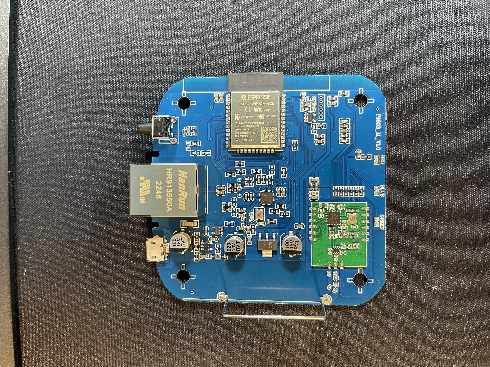
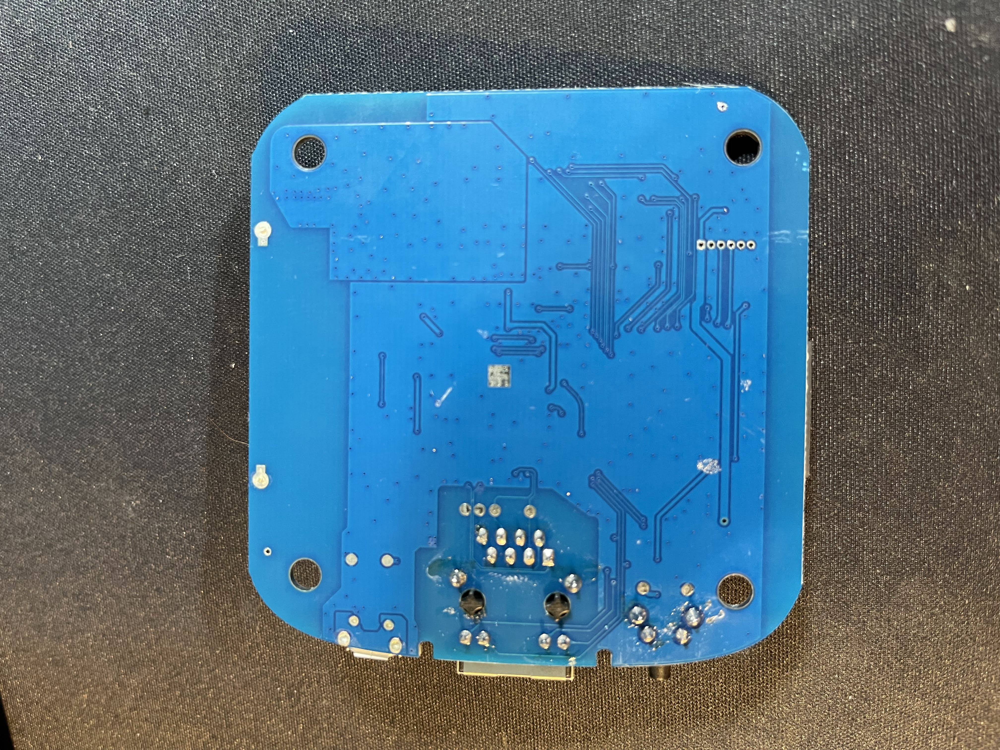
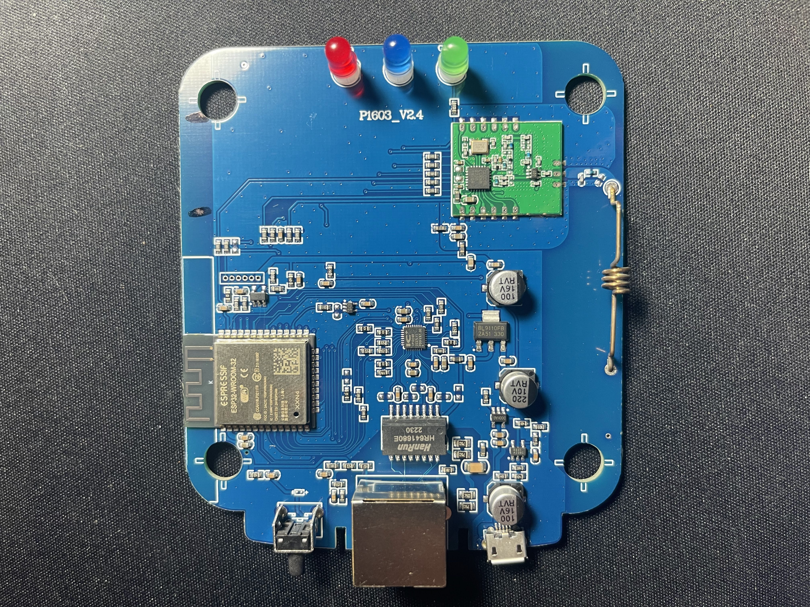
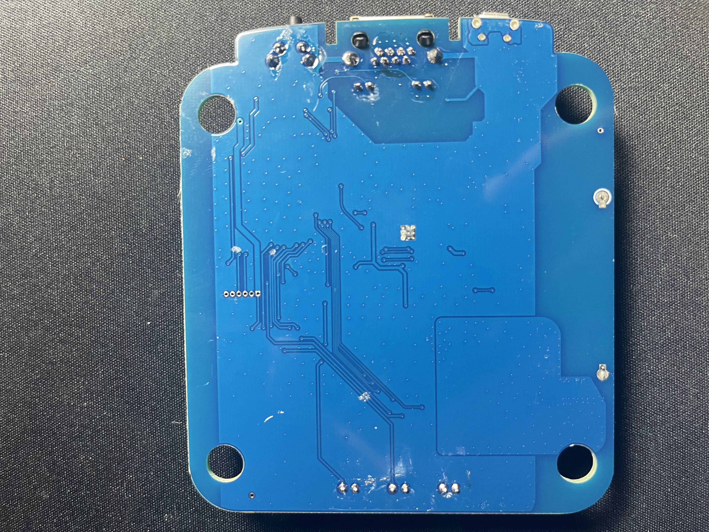
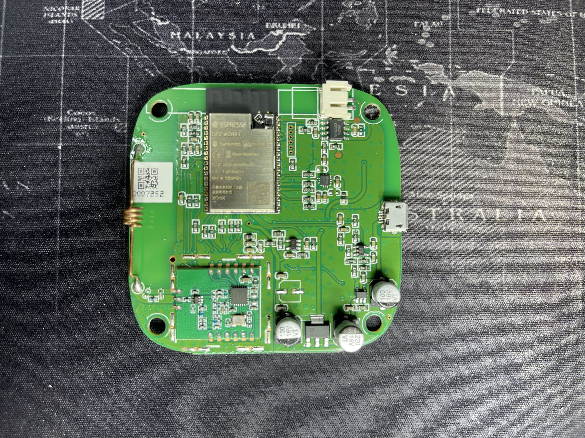
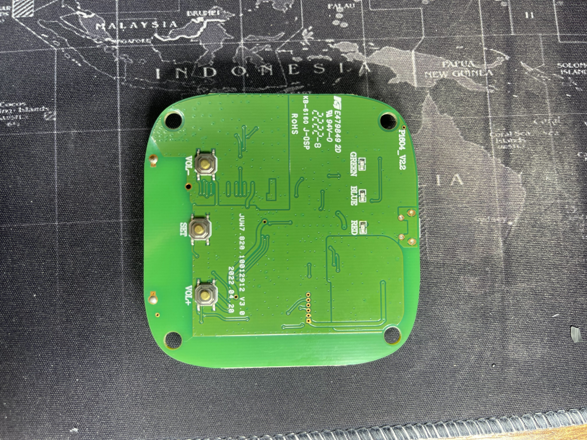

# Reverse Engineering of YoLink Hub

> Draft notes for an eventual blog post. Kept intentionally close to the original working notes; see the "Brain Dump" section at the bottom for what's still unfinished.

# Reason
- Solar Flood Lights
  - _use IR remote to control_
  - _may eventually hardwire_

# How to control from Home Assistant?
## Options
**WiFi IR Blaster**
- Not enough range
- Running WiFi back there would be expensive

**BLE IR blaster**
- Not enough range

**433Mhz IR blaster**
- DIY Solution
  - Doubted ability to build a waterproof DIY solution

**Need something waterproof with long range, is battery powered, and can be controlled locally with Home Assistant**

# Enter YoLink
## Benefits
- Long Range (1/4 mile)
- Battery Powered
  - Long Battery Life
- Have an IR blaster (May or may not be waterproof)
- Additional Sensor Types
  - Vibration
    - Monitor train activity
  - Motion
    - Perimeter Alarm
    - Animal Life
    - Camera Triggering

## Downsides
- YoLink App/Cloud
  - No Local Control
  - Home Assistant integration relies on their cloud

# Hardware Teardown
## Hubs
| Nickname    | Product/Rev | Top                                                                  | Bottom                                                                     |
|:------------|:------------|:---------------------------------------------------------------------|:----------------------------------------------------------------------------|
| ns_hub_mini | [P1603 V1.0](../../hubs/P1603/V1.0) |  |  |
| ns_hub_big  | [P1603 V2.4](../../hubs/P1603/V2.4) |  |  |
| speaker_hub | [P1604 V2.2](../../hubs/P1604/V2.2) |  |  |

See [image_tables.md](image_tables.md) for the debug-header photos too.

### Non-Speaker Hubs
- For ease of reference, the hubs are given nicknames
- Analysis was done primarily on ns_hub_mini
- _smaller hub looks to be a refinement and more compact_

- Chips/Part Numbers of Interest
  - **esp32-wroom-32**
  - **llcc68**
    - Semtech, similar to SX126x/SX127x
    - _later call out the strings output indicating hal file_
    - Looks to be a COTS module with balun and modulation circuitry
    - Communicates with the esp32 over SPI

### Speaker Hub (P1604)
- No Ethernet
- Otherwise appears to be the same board family as the non-speaker hubs

All hubs appear to be the same design, albeit more compact and with some components present in some hubs and not others. Notably, the speaker hub does not have Ethernet connectivity. It is likely that the code running on the hubs is the same.
- _verify the software is the same_

## Sensors
- _get pics of some sensor internals_
- Uses the [YL09](../../chips/YL09) chip
  - YoLink-branded SiP based on an STM32L0 with an integrated LoRa (SX1276-family) radio

# Reverse Engineering and Understanding of YoLink's Architecture
## Hardware investigation
### Debug headers
  - 1.27mm spacing
  - VCC(3.3v), GND, RX, TX, EN?, GPIO0?
    - Probed via continuity
    - Eventually bought a logic analyzer, which would have made this easier
  - See [hubs/README.md](../../hubs/README.md) for the full pinout table

### Serial Logs
- Seems pretty verbose
  - Clearly indicates the `esp-idf` version as `3.2-dirty`
  - Initial boot process (from factory) appears to be:
    - Start ethernet interface and broadcast an AP
    - If ethernet is UP
      - Attempt dhcp
      - If dhcp succeeds
        - Get configuration from api.yolink.com
      - ElseIf DHCP fails
        - Continue with wifi setup
    - ElseIf ethernet is DOWN
      - Wait for device to connect to WiFi AP
      - Once a device connects, start web server and wait for WiFi credentials
      - Once WiFi credentials are received, attempt to connect to specified WiFi AP
      - If connection is unsuccessful
        - Restart broadcasting AP and repeat
      - ElseIf connection is successful
        - Get configuration from api.yolink.com
    - Once configuration is received from api.yolink.com, register with api.yolink.com MQTT server
    - Once registered with api.yolink.com MQTT, begin listening for LoRa messages
    - Once a LoRa message is received, forward it to api.yolink.com MQTT
      - api.yolink.com MQTT appears to respond with an ACK message that may or may not be forwarded to the reporting sensor via LoRa
  - Hub appears to send ALL LoRa messages via MQTT
    - Meaning that if a sensor that belongs to someone else's account sends a LoRa message, a hub that is not registered to that user still forwards the message to YoLink's servers.
      - This could be beneficial, as it could allow a hub to receive all LoRa traffic without needing to be registered (more investigation needed) - **CONFIRMED**, see [testing_methodology.md](../testing_methodology.md)
  - MQTT
    - YoLink's MQTT server appears to use some form of authentication (password)
  - Hub gets a "configuration" from a URL that appears to be unauthenticated and appears to be generated from the UUID/SN of the hub
    - Potential to host a local webserver where the hub gets this config from
      - Only thing here is to trick the hub into looking at a local server instead of YoLink's for the config URL
        - Would require ARP poisoning/DNS cache poisoning, OR modifying the firmware
          - Local server might need to implement some logic to reply with the ACK message as seen in some of the serial logs

## Flash Dumping

### Flash Dump Analysis
- Strings
  - Indicated mqtt
  - Line indicating `SX126x hal`
    - `Show image of terminal line showing this`
  - `api.yolink.com`
    - YoLink's URL appears 4 times in the flash dump
    - Modifying flash might trip security mechanisms, thus making a local server mechanism possibly preferable
- Binwalk
  - Binwalk reveals mostly nothing of note
    - Some linux paths
    - Some encryption-related strings
- Ghidra
  - Initial load not promising
  - Found articles on loading an esp32 flash dump into Ghidra (see [docs/references](../references)), citing `esp32-flash-loader` and `esp32-flash-parser`
  - Cloned the referenced repos
    - Found that the repos needed more work
    - Found a PR for xtensa that was stale
    - Combined forks and addressed the stale PR's review feedback
    - _link our PR once it lands upstream_
  - Function ID
    - Built esp-idf to generate Rizzo signatures - see [esp-idf_rizzo](../../tools/esp-idf/esp-idf_rizzo) / [ghidra-rizzo](../../tools/ghidra/scripts/ghidra-rizzo)
  - Ghidra data types
    - Built esp-idf to generate GDT files - see [esp-idf_gdt](../../tools/esp-idf/esp-idf_gdt) / [ghidra-gdt](../../tools/ghidra/scripts/ghidra-gdt)
  - Loaded everything into Ghidra to get a solid starting point for reversing the dump
  - Used the SVD loader ([ghidra-svd-loader](../../tools/ghidra/scripts/ghidra-svd-loader)) to resolve multiple addresses for peripherals
  - See [docs/GhidraProjects.md notes folded into tools/ghidra/README.md] for the overall process used to set up Ghidra for these dumps

# Brain Dump (still to do)
- Need to include images
  - Terminal output lines from strings
  - Debug pictures
- Need to separate the analysis portion by hub/process (large hub first, then smaller hub)
- Need to include links to
  - Blog post(s) specifying Ghidra + esp32 loading
  - Amazon links to products used
- Mention products used (serial interface, JTAG interface, etc.)
- Include commands used (for dumping flash, strings, binwalk, etc.)
- Talk about trying to find the hal.c file
- Talk about OpenMQTTGateway
- Talk about Heltec and RNode for monitoring LoRa traffic
- Talk about ESPHome (mention flauviut's tutorial on the Emporia Vue 2)

# Other stuff
Useful for MITM'ing a YoLink hub:
- https://www.dinofizzotti.com/blog/2022-04-24-running-a-man-in-the-middle-proxy-on-a-raspberry-pi-4/
