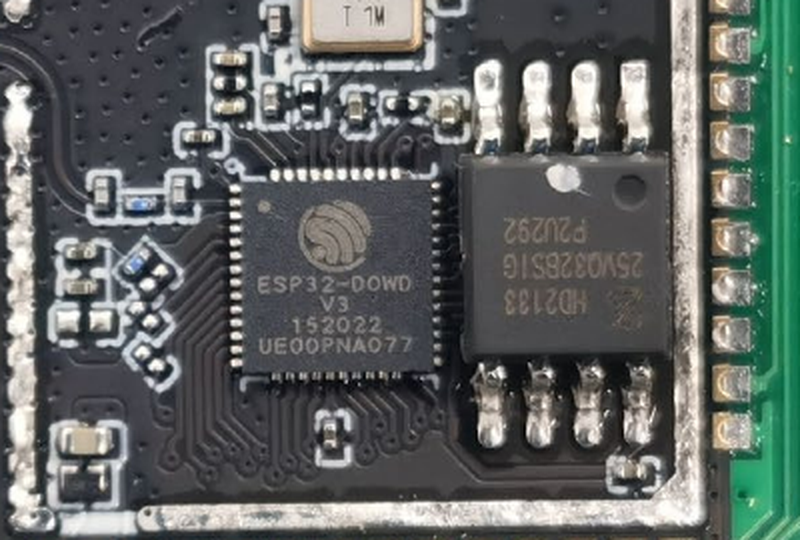
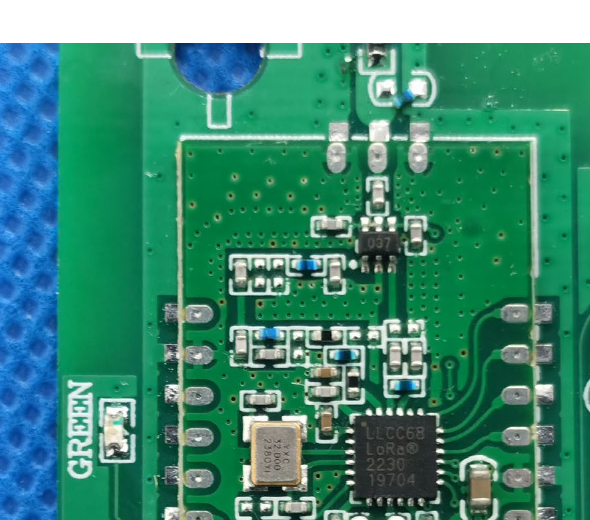
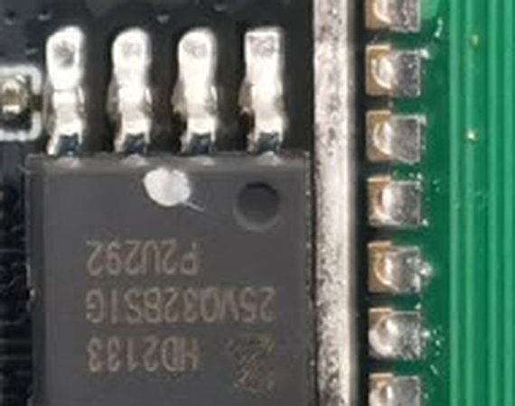
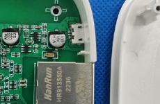

# Chip Identification — 2ATM71603M (YoLink Hub)

Covers both physical form factors in this repo that share this single FCC filing: [hubs/P1603/V1.0](../../hubs/P1603/V1.0) ("mini" hub) and [hubs/P1603/V2.4](../../hubs/P1603/V2.4) ("big" hub) — same electrical design, different enclosure, which is why YoSmart didn't need to re-file.

Source: [`Internal Photos/Internal Photos-02ef7d90.pdf`](Internal%20Photos/Internal%20Photos-02ef7d90.pdf), 4 pages. This filing's photos include hand-annotated antenna callouts (LoRa vs. WiFi), which made positive identification much easier than usual.

## Main SoC — Espressif ESP32-D0WD-V3

Marked `ESP32-D0WD V3 / 152022 / UE00PNA077`. Dual-core Xtensa LX6, handles WiFi/BLE, Ethernet (via the HanRun magnetics below), and drives the LoRa radio over SPI. This is the chip [tools/ghidra/processors/ghidra-xtensa](../../tools/ghidra/processors/ghidra-xtensa) and the esp-idf-based Ghidra tooling in [tools/esp-idf](../../tools/esp-idf) target.

Datasheet: [reference_data/datasheets/esp32-datasheet.pdf](../../reference_data/datasheets/esp32-datasheet.pdf)

## LoRa Radio — Semtech LLCC68

Marked `LLCC68 / LoRa® / 2230 / 19704`. Semtech's lower-cost sibling to the SX126x family — sub-GHz LoRa transceiver, connected to the ESP32 over SPI. This confirms the identification already noted in the project writeup before the FCC photos were pulled.

Datasheet: [reference_data/datasheets/semtech-llcc68.pdf](../../reference_data/datasheets/semtech-llcc68.pdf)

## External SPI Flash

Marked `25VQ32BSIG / HD2133 / P2U292` (manufacturer prefix not fully legible in the available photo — likely a GigaDevice GD25VQ32-family or similar 32Mbit SPI NOR flash). Holds the ESP32 firmware image analyzed elsewhere in this repo (`hubs/P1603/*/firmware/`).

Closest datasheet on file: [reference_data/datasheets/gigadevice-gd25q32c.pdf](../../reference_data/datasheets/gigadevice-gd25q32c.pdf) (same-density GD25Q32 family; the exact low-power "V" variant datasheet wasn't confirmed identical).

## Ethernet Magnetics/Jack — HanRun HR911550A

Marked `HanRun / HR911550A / 2236`. Integrated RJ45 jack + magnetics module, standard part for Ethernet-equipped embedded boards - not a YoLink-specific or otherwise notable chip, included here for completeness since it's one of the larger/more visible components on the board.

## Not identified
A small QFN chip sits just left of the ESP32 module on the front of the board (visible in the wider board photos but not legible at the photo resolution FCC provides). Given its position and passives, it's plausibly a power-management IC (battery/USB charging or regulation) rather than anything RF-related, but this is unconfirmed.
