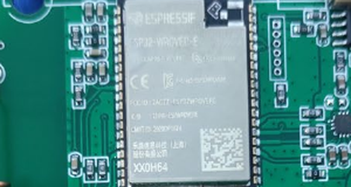
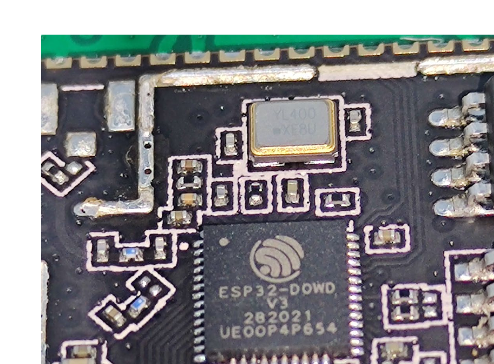
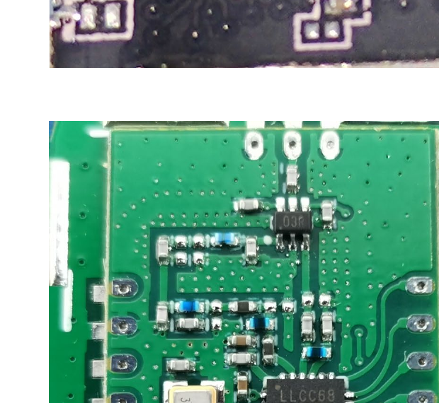

# Chip Identification — 2ATM71604 (Speaker Hub)

Covers [hubs/P1604/V2.2](../../hubs/P1604/V2.2) — silkscreen confirms `P1604_V2.2`.

Source: [`Internal Photos/Internal Photos-b1b6eee2.pdf`](Internal%20Photos/Internal%20Photos-b1b6eee2.pdf), 3 pages, including a macro shot with the WiFi module's shield can removed, revealing the chips underneath.

## WiFi/Main Module — Espressif ESP32-WROVER-E

Unlike the [P1603 hub](../2ATM71603M/chip_identification.md), which uses a bare ESP32-D0WD-V3 soldered directly to the board, this design uses a full **ESP32-WROVER-E** module (marked `ESPRESSIF ESP32-WROVER-E`) — the module variant that includes onboard PSRAM. Makes sense for a hub that also has to drive a speaker/audio path, which is more RAM-hungry than the plain relay function of the other hubs.

With the module's shield removed, the internals are visible and individually marked:

- **Espressif ESP32-D0WD-V3** (marked `ESP32-D0WD V3 / 282021 / UE00P4P654`) — same silicon as the P1603 hub. Datasheet: [reference_data/datasheets/esp32-datasheet.pdf](../../reference_data/datasheets/esp32-datasheet.pdf)
- **GigaDevice GD25Q64E** SPI NOR flash (marked `GigaDevice / 25Q64ESIG / C005806 / RJ2126`) — 64Mbit, twice the capacity of the flash on the P1603 board. Datasheet not successfully retrieved (every mirror tried required login or blocked scripted downloads) - see [reference_data/datasheets/README.md](../../reference_data/datasheets/README.md) for what was tried; product page: https://www.gigadevice.com/product/flash/spi-nor-flash/gd25q64e
- **Espressif PSRAM64H** (marked `ESP / PSRAM64H / 182021 / 1500056`) — 64Mbit PSRAM, the reason this hub needed the WROVER module instead of a plain WROOM/bare-chip design. Datasheet: [reference_data/datasheets/espressif-psram64h.pdf](../../reference_data/datasheets/espressif-psram64h.pdf)

## LoRa Radio — Semtech LLCC68

Marked `LLCC68 / LoRa® / 1951 / 73124`. Same part as the P1603 hub - confirms YoLink standardized on the LLCC68 across at least these two hub generations, driving the "923M TX Antenna" labeled in the filing's antenna-callout photo.

Datasheet: [reference_data/datasheets/semtech-llcc68.pdf](../../reference_data/datasheets/semtech-llcc68.pdf)

## Not yet identified
The audio amplifier/speaker driver circuitry (this is, after all, the *speaker* hub) wasn't isolated to a clearly-legible chip in the available photos - worth a closer look if higher-resolution photos or the physical board become available again.
