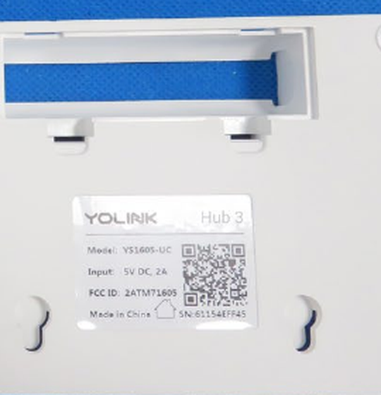
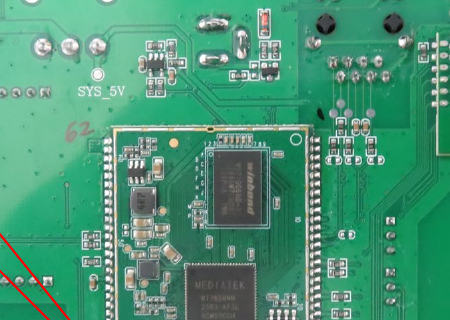
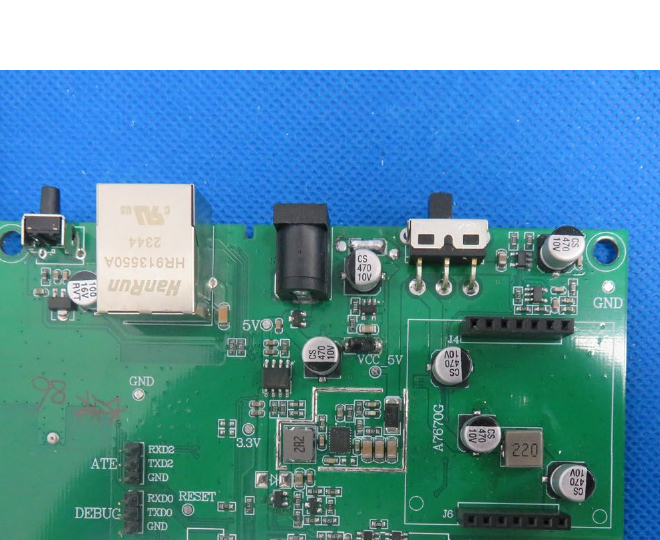
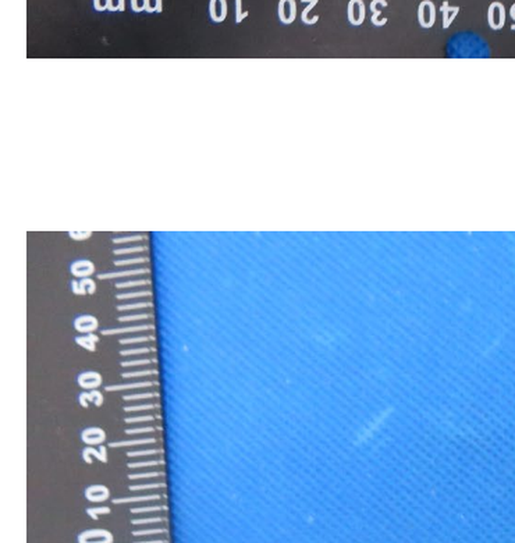

# Chip Identification — 2ATM71605 ("Hub 3")

Product label confirms `YOLINK Hub 3, Model: YS1605-UC, FCC ID: 2ATM71605`.

**✅ Resolved — this filing covers [hubs/P1605](../../hubs/P1605) only, not [hubs/P1606](../../hubs/P1606).** An earlier pass through this repo mistakenly linked this filing from both devices, since P1605 and P1606 were recalled as sharing an FCC ID. They don't. The internal-photos board here is silkscreened `P1605_V1.3` and uses a MediaTek MT7628NN (see below) — a MIPS-based SoC. P1606's own serial boot capture (`hubs/P1606/V1.0/serial/uart_debug_1500000_power_on.log`) shows `BL31`/`GICv3`/`EL3`/"Preloader serial" - ARM Trusted Firmware boot stages that only exist on 64-bit ARM SoCs, plus an LPDDR4 DDR-training sequence characteristic of Rockchip's SPL, and the login banner reads `YS1606 login:` (P1606's real model is YS1606, distinct from P1605's YS1605-UC). MediaTek MT7628 (MIPS, no GICv3/EL3/BL31 concepts at all) cannot produce that log. P1606 is a genuinely different, ARM/Rockchip-based piece of hardware, most likely certified under its own FCC ID - none has been identified for it yet in this repo (no `2ATM71606` or similar turned up in the grantee `2ATM7` listing pulled so far).

Source: [`Internal Photos/Internal Photos-89837057.pdf`](Internal%20Photos/Internal%20Photos-89837057.pdf), 6 pages (also includes a bare 18650 li-ion cell — this hub has battery backup).

## Main SoC — MediaTek MT7628NN

Marked `MEDIATEK / MT7628NN / 2503-AF34` (partial - last line not fully legible). MT7628 is a MIPS-based WiFi router SoC (802.11n, integrated Ethernet switch) - a very different architecture from the Xtensa ESP32 used in [P1603](../2ATM71603M/chip_identification.md) and [P1604](../2ATM71604/chip_identification.md). Paired with a Winbond-branded package (likely serial NAND/eMMC flash or DRAM - exact part not legible) mounted on the same small system-on-module board.

Datasheet: [reference_data/datasheets/mediatek-mt7628nn.pdf](../../reference_data/datasheets/mediatek-mt7628nn.pdf)

## Board / connectivity notes

- `ATE`/`DEBUG` header rows are silkscreened directly on the board (`RXD2/TXD2/GND` for ATE, `RXD0/TXD0/RESET/GND` for DEBUG) - no need to hunt for test points on this one.
- `HanRun` Ethernet magnetics (same family of part as the other hubs).
- 18650 Li-ion cell (EVE `ICR18650/26V`, 2.55Ah) for battery backup - notable since none of the ESP32-based hubs in this repo are documented as having battery backup.
- The filing's antenna-callout photo labels `923.3Mhz Antenna` plus two separate `WIFI 2.4G` antennas (A and B) - so this board still does LoRa, WiFi, and (per the antenna diversity) possibly does it more seriously than the single-antenna ESP32 hubs.

## LoRa Radio — likely LLCC68, unconfirmed

LoRa isn't on the main MediaTek board at all - it's a **separate small daughter card** with its own QFN radio chip, connected to the main board. Given YoLink used the Semtech LLCC68 on both other hubs in this repo, that's the most likely part here too. Re-examined at 1200dpi - the chip package itself shows no visible marking at all in FCC's source photo (not just blurry text, genuinely no legible print), and the daughter card's own silkscreen text is too blurred to read either. Not resolvable from this filing's photos; worth a second look with the physical hardware if you still have it.
