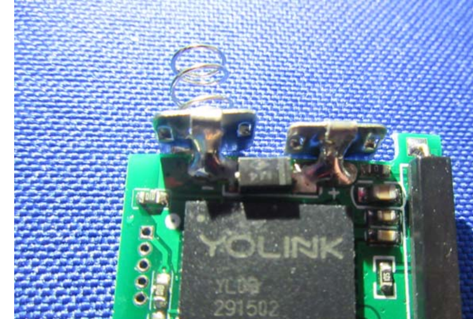

# Chip Identification — 2ATM77704 (Door Sensor)

Board silkscreen reads `YS7704-CE DoorSensor_2 / Ver: 0.2 / 20190423`, confirming this filing covers both [sensors/YS7704](../../sensors/YS7704) (the finished door sensor product) and [sensors/P0706](../../sensors/P0706) (the underlying sensor board design, reused across multiple products per its own README).

Source: [`Internal Photos/Internal Photos-b0ed08e9.pdf`](Internal%20Photos/Internal%20Photos-b0ed08e9.pdf), 2 pages. AAA-battery powered.

## Radio/MCU SiP — YoLink YL09

Marked `YOLINK / YL09 / 291502 / 1913`. This is YoLink's own custom SiP - see [chips/YL09](../../chips/YL09) for the rest of what's known about it (STM32L0 core with an integrated LoRa-family radio, present in almost all of YoLink's battery sensors). This FCC photo is the clearest confirmed close-up shot of the chip's actual branding available anywhere in this repo - worth copying into `chips/YL09/` alongside the existing (externally-hosted) diagram images.

No other chips of note on this board - it's a minimal single-SiP design (YL09 handles both the sensing/logic and the radio), plus basic passives and the reed switch / door-sensing input.
