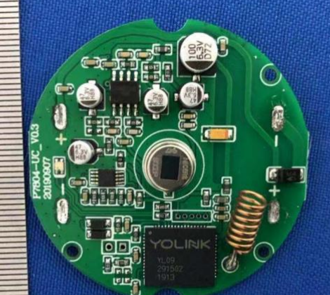
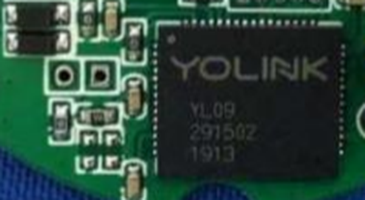
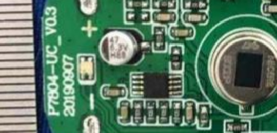

# Chip Identification — 2ATM77804 ("Motion Sensor")

**⚠️ Correction — this is NOT [sensors/P7805](../../sensors/P7805).** The board photographed in this filing is silkscreened `P7804-UC_V0.3 / 20190907` — a different internal board number (P7804, not P7805). The `2ATM77804`/`P7804` numeric similarity is what led to the original guess that this filing covered P7805; it doesn't. **The real FCC filing for P7805 is still unidentified** - do not treat this as resolved. This filing is kept in the repo anyway since the photos and chip ID are still genuinely useful reference material (same chip family, same general PIR-sensor design), just filed under its own identity rather than folded into an existing device directory.

Source: [`Internal Photos/internal photos-f156c848.pdf`](Internal%20Photos/internal%20photos-f156c848.pdf), 3 pages. AA-battery powered, round PCB with a PIR (passive infrared) sensing element - a motion sensor, same general design language as P7805 (round board, metal-can PIR element with visible window) but a distinct product/revision.

## Radio/MCU SiP — YoLink YL09

Marked `YOLINK / YL09 / 291502 / 1913` — same exact date/lot code markings (`291502 1913`) as the chip photographed in the [door sensor filing](../2ATM77704/chip_identification.md), suggesting these two products/filings may have used chips from the same manufacturing batch.

## Board label

