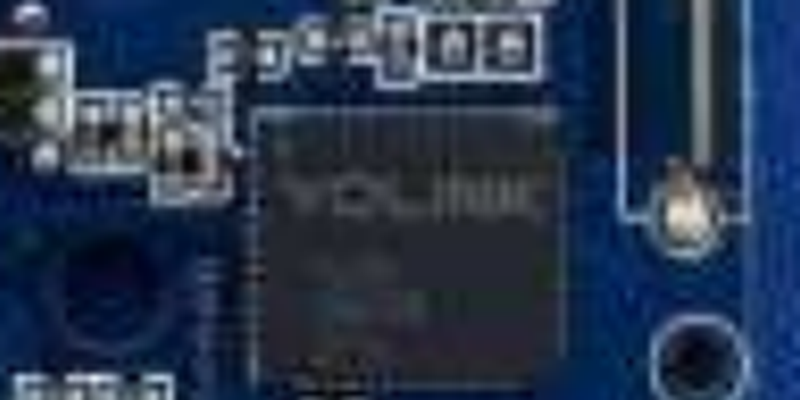
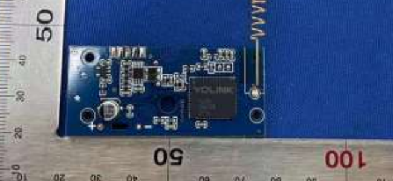

# Chip Identification — 2ATM77805 (Outdoor Motion Sensor)

Covers [sensors/YS7804](../../sensors/YS7804). Weatherproof grey enclosure, two-board design (PIR sensor board connected via ribbon cable to a separate main/radio board) plus an AA battery holder - similar general architecture to [P7805](../../sensors/P7805) and the [P7804 filing](../2ATM77804/chip_identification.md), but its own distinct product.

Source: [`Internal Photos/Internal Photos-c2e19bd5.pdf`](Internal%20Photos/Internal%20Photos-c2e19bd5.pdf), 5 pages.

## Radio/MCU SiP — YoLink YL09

Marked `YOLINK` (full lot code not legible against the dark blue soldermask - lower contrast than the green boards used elsewhere made this one harder to photograph clearly). Positioned right next to the antenna coil, consistent with every other YoLink battery sensor in this repo - YL09 continues to be the standard radio/MCU part across the whole sensor lineup.
