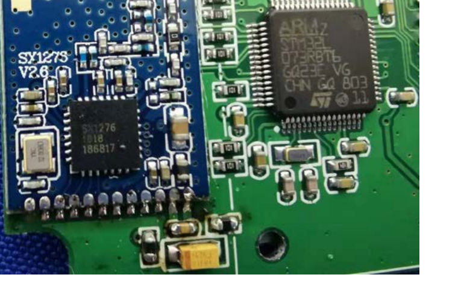
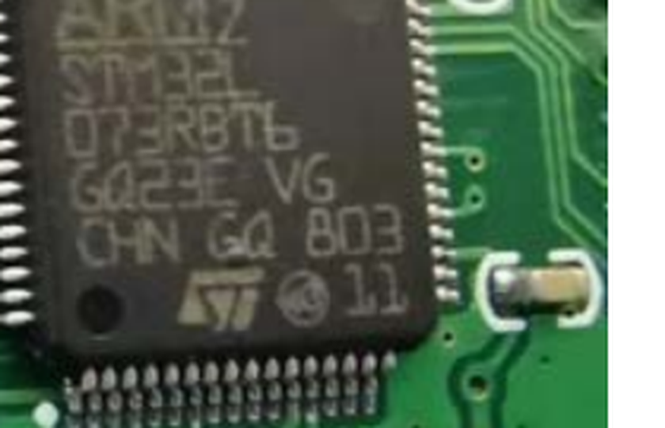
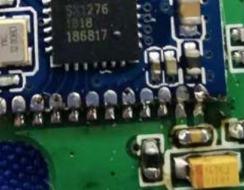

# Chip Identification — 2ATM78003 (Temperature Humidity Sensor)

Covers [sensors/YS8003](../../sensors/YS8003). Board and LCD module both silkscreened `YS8003-UC_V1.0`. Notably different design from every other sensor in this repo: instead of the integrated [YL09](../../chips/YL09) SiP, this one uses a **discrete MCU + separate LoRa radio module**, plus it has an LCD display (visible in the filing photos) - none of the other battery sensors documented so far have a screen.

Source: [`Internal Photos/Int_Photos-8bd46313.pdf`](Internal%20Photos/Int_Photos-8bd46313.pdf), 3 pages.

## MCU — STMicroelectronics STM32L073RBT6

Marked `STM32L / 073RBT6 / GQ23E VG / CHN GQ 803`, with the ST logo. ARM Cortex-M0+, 128KB flash - notably, this is the same STM32L0 family core that's integrated inside the YL09 SiP used everywhere else in this repo (see [chips/YL09/stm32L073xZ](../../chips/YL09/stm32L073xZ) for the reference manual already on file), just used here as a standalone chip instead of YoLink's own SiP package.

Datasheet: already on file at [chips/YL09/stm32L073xZ/stm32l073v8.pdf](../../chips/YL09/stm32L073xZ/stm32l073v8.pdf) (covers the STM32L073x8/xB/xZ family, including this RB variant).

## LoRa Radio — Semtech SX1276

Marked `SX1276 / 1818 / 186817`, mounted on its own small daughter board silkscreened `SX1276 V2.6`. This is a different Semtech part than the LLCC68 used on the hubs - SX1276 is the older/higher-end sibling in the same product line. Given this filing dates to 2019 (the earliest of the sensor filings gathered here), this may simply reflect what was available/standard for YoLink at the time, before they standardized on LLCC68 for newer designs.

Datasheet: [reference_data/datasheets/semtech-sx1276.pdf](../../reference_data/datasheets/semtech-sx1276.pdf)

## Display
LCD module present, silkscreened `YS8003-UC_V1.0` - consistent with this being the only sensor in the repo's current lineup with an on-device readout rather than LEDs only.
